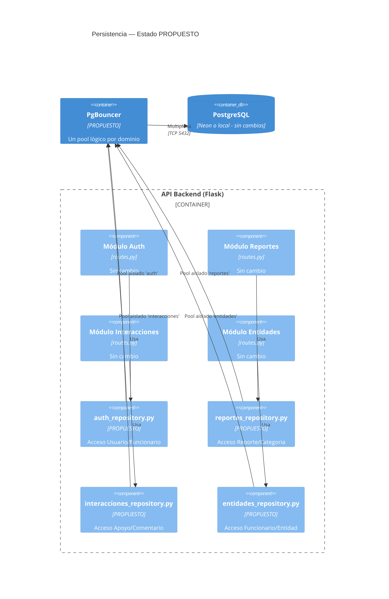

## **ADR 0002 — Aislamiento de Persistencia entre Módulos de Dominio y PostgreSQL**

**Autores:** Johan Felipe Aguilar Castillo · Samuel Alejandro González Grajales · Juan David Barragán

**Estado:** Propuesta (no implementada)

**Documentos relacionados:** ADR 0001 · 04-escenarios-calidad.md §5 · 07-c4-componentes.md

## **Contexto**

* **Estado Actual:** El ADR 0001 estableció una Arquitectura por Capas con un **único pool de conexiones** compartido hacia PostgreSQL.
* **Evidencia (ESC-07):** Bajo carga agresiva (800 VUs), la ruta /login presenta una tasa de error del 11,11% (p95: 31,06 s) debido al agotamiento del pool (límite actual: 15 conexiones por defecto).
* **Problema Arquitectónico:** Las rutas invocan Model.query directamente. No hay aislamiento; la saturación de /login bloquea funcionalmente otros dominios independientes como /reportes.

## **Alternativas consideradas**

1. **Aumentar pool_size y max_overflow (Descartada):** No resuelve el defecto estructural (pool compartido) y choca con el límite estricto de conexiones concurrentes del plan gratuito de Neon.
2. **Réplicas de lectura / CQRS (Descartada):** El problema medido es por agotamiento de conexiones, no contención de lectura/escritura. Añade latencia de sincronización injustificada.
3. **Capa de Repositorio + Pooling aislado por dominio (Elegida):** Introducir repositorios como único punto de acceso a db.session y usar **PgBouncer** (transaction pooling) para asignar un límite de conexiones independiente a cada dominio.

## **Decisión**

Se introduce una **frontera explícita de persistencia** estructurada en dos capas:

1. **Capa de Repositorio:** Encapsula las consultas de SQLAlchemy sin añadir nueva lógica de negocio.
2. **PgBouncer:** Configurado con un pool lógico dedicado por cada módulo.

routes.py (sin cambios de negocio) -> Capa de Repositorio (acceso a DB) -> PgBouncer (pool por dominio) -> PostgreSQL

### **Diagrama C4 — Estado Propuesto**

## **Consecuencias**

**Positivas:**

* **Aislamiento de fallos:** La saturación de /login ya no agota el pool de /reportes.
* **Testeabilidad:** El acceso a datos se puede *mockear* de forma aislada.
* **Reversibilidad de Infraestructura:** Facilita futuras migraciones sin tocar routes.py.

**Negativas (sin evasivas):**

* **No resuelve el cuello de botella general:** No mitiga la degradación intrínseca del servidor de desarrollo de Werkzeug identificada en ESC-07.
* **Complejidad Operativa:** Añade un nuevo punto de fallo (PgBouncer) a monitorear.
* **Latencia:** Añade ~1-3 ms por el salto extra de red hacia PgBouncer.
* **Cuellos de botella aislados:** Si un dominio agota su pool específico, fallará aunque los demás pools estén ociosos.

## **Costo estimado (horas de ingeniería)**

| Tarea | Horas | Base de la estimación |
| :---- | :---- | :---- |
| Extraer auth_repository.py | 4 h | 3 manejadores, acceso a Usuario/Funcionario |
| Extraer reportes_repository.py | 6 h | Mayor superficie de código |
| Extraer interacciones_repository.py | 3 h | Lógica acotada |
| Extraer entidades_repository.py | 3 h | Menor complejidad |
| Pruebas de regresión manuales | 4 h | Sin CI; uso de Postman |
| Configurar PgBouncer (docker-compose.yml) | 4 h | Servicio nuevo, 4 pools lógicos |
| Re-ejecución ESC-07 (validación cruzada) | 4 h | Medir /login vs /reportes en paralelo |
| Documentación | 2 h | Actualizaciones |
| **Total** | **30 h** | **~1 semana repartida en 3 integrantes** |

## **Reversibilidad**

**Media:**

* **PgBouncer (Reversión rápida):** Reversible en minutos cambiando la DATABASE_URL hacia el host original en .env.
* **Repositorios (Reversión costosa):** Deshacer la inyección de repositorios exige un refactor manual estimado en ~16 h (costo de extracción inverso).

## **Defensa ante restricción inyectada en vivo**

**Restricción hipotética:** *"El regulador prohíbe compartir la instancia física de PostgreSQL entre localidades/entidades."*

* **Qué sobrevive:** La capa de Repositorio (rutas siguen sin conocer la ubicación de los datos).
* **Qué cae:** La configuración actual de PgBouncer (multiplexa a una sola instancia). Se requeriría un enrutador por *tenant* o lógica de ruteo dentro del repositorio.
* **Nuevos trade-offs (Consistencia):**
  * Las transacciones ACID inter-dominio (ej. get_mis_reportes() con JOINs entre Reporte y Categoría) se pierden si residen en instancias distintas, forzando **consistencia eventual** vía agregación en aplicación.
  * Pérdida de fuente única de verdad para reportes que involucren límites geográficos compartidos.
* **Spikes de verificación requeridos:**
  1. Prototipo de enrutamiento de conexión por entidad_id en el repositorio.
  2. Prueba de viabilidad para agregación de reportes distribuidos.
  3. Script de partición/migración de tablas existentes por localidad.
