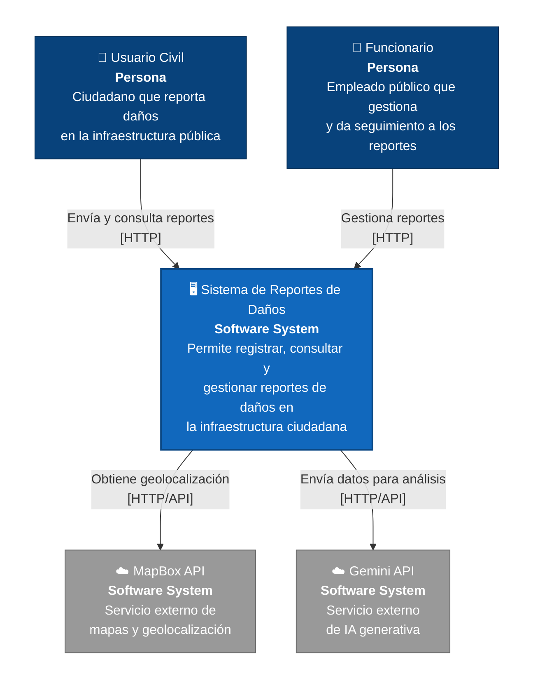

# Descripción del Modelo C4 (Nivel 1) – UrbanFix

**Autores:** Johan Felipe Aguilar Castillo · Samuel Alejandro González Grajales · Juan David Barragán

---

## NIVEL 1 — Diagrama de Contexto del Sistema

Tenemos un sistema general de reportes de daños de infraestructura ciudadana. Se comunica con los usuarios (usuarios civiles y funcionarios) por medio de protocolo HTTP, y hace uso de 2 APIs externas (MapBox y Gemini).

### Descripción de la vista

- **Propósito de la vista:** mostrar, en el nivel más alto de abstracción del modelo C4, cómo el Sistema de Reportes de Daños de Infraestructura Ciudadana (UrbanFix) se relaciona con las personas que lo usan y con los sistemas externos de los que depende, sin entrar todavía en detalles de contenedores o componentes internos.
- **Audiencia:** stakeholders no técnicos y técnicos que necesitan entender el alcance general del sistema (docentes evaluadores, equipo del proyecto, entidades públicas interesadas), antes de profundizar en decisiones de arquitectura interna.
- **Personas / actores:**
  - *Usuario Civil:* ciudadano que reporta daños en la infraestructura pública.
  - *Funcionario:* empleado público que gestiona y da seguimiento a los reportes.
- **Sistemas externos relevantes:**
  - *MapBox API:* servicio externo de mapas y geolocalización.
  - *Gemini API:* servicio externo de IA generativa.
- **Relaciones principales:** el sistema recibe reportes y consultas de los Usuarios Civiles, recibe gestión y seguimiento de los Funcionarios, y a su vez consume dos servicios externos (MapBox para geolocalización y Gemini para análisis de datos).

---

## Análisis de las relaciones

**Usuario Civil → Sistema de Reportes de Daños ("Envía y consulta reportes" [HTTP])**
Esta relación representa el flujo principal de entrada de información al sistema: el ciudadano crea un reporte de daño (por ejemplo, un hueco en la vía o un daño en el alumbrado público) y también consulta el estado de reportes ya existentes. Al ser HTTP, se asume que la interacción ocurre a través de la app móvil, que internamente consume la API REST del backend. Esta relación es la que le da sentido social al sistema: sin la participación ciudadana no habría datos que gestionar.

**Funcionario → Sistema de Reportes de Daños ("Gestiona reportes" [HTTP])**
Representa el flujo de administración y seguimiento: el funcionario público revisa los reportes generados por los ciudadanos, actualiza su estado, y en general ejerce el rol de gestión sobre la información recolectada. Esta relación cierra el ciclo del propósito del sistema, ya que convierte los reportes ciudadanos en acciones o respuestas institucionales.

**Sistema de Reportes de Daños → MapBox API ("Obtiene geolocalización" [HTTP/API])**
Esta relación es una dependencia técnica: el sistema delega en un servicio externo especializado la resolución de ubicaciones geográficas (coordenadas, direcciones, mapas), en lugar de implementar esa lógica internamente. Esto reduce la complejidad propia del sistema, pero también introduce una dependencia externa: si MapBox no está disponible, la funcionalidad de geolocalización del sistema se ve afectada.

**Sistema de Reportes de Daños → Gemini API ("Envía datos para análisis" [HTTP/API])**
Refleja el uso de un servicio de IA generativa externo para procesar o enriquecer los datos de los reportes (por ejemplo, clasificación automática del tipo de daño a partir de imágenes o texto). Al igual que con MapBox, el sistema delega una capacidad especializada (procesamiento de IA) en un proveedor externo, lo que agiliza el desarrollo pero acopla el funcionamiento del sistema a la disponibilidad y comportamiento de un tercero.

**Lectura general del diagrama**
En conjunto, las cuatro relaciones muestran un sistema que actúa como intermediario entre dos tipos de personas (ciudadanos y funcionarios) con roles complementarios —una que reporta y consulta, otra que gestiona— y dos servicios externos que le aportan capacidades que el sistema no resuelve por sí mismo (geolocalización e inteligencia artificial). Esta vista de contexto deja claro el alcance del sistema (qué está dentro de la línea del sistema y qué queda fuera, como MapBox y Gemini) sin comprometerse todavía con decisiones de implementación, que es justamente lo que corresponde al Nivel 1 del modelo C4.
