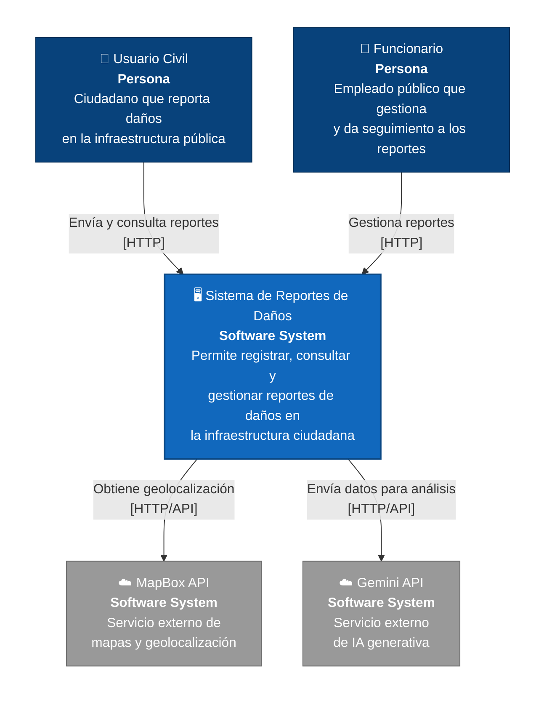
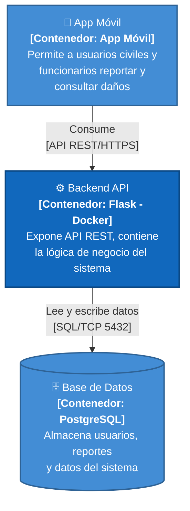
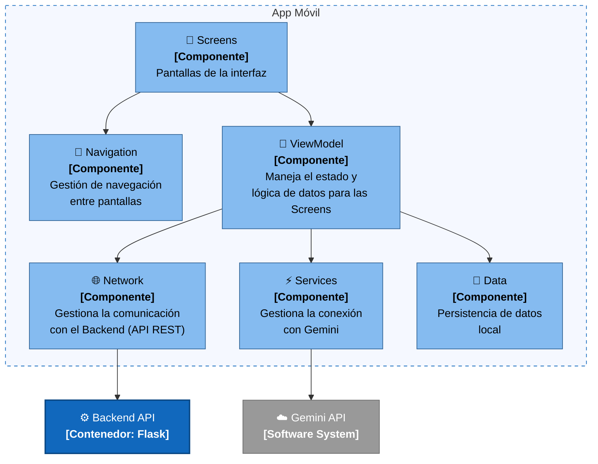

# Descripción del Modelo C4 (hasta NIVEL 3) – UrbanFix

**Autores:** Johan Felipe Aguilar Castillo · Samuel Alejandro González Grajales · Juan David Barragán

---

## NIVEL 1 — Diagrama de Contexto del Sistema

Tenemos un sistema general de reportes de daños de infraestructura ciudadana. Se comunica con los usuarios (usuarios civiles y funcionarios) por medio de protocolo HTTP, y hace uso de 2 APIs externas (MapBox y Gemini).

---

## NIVEL 2 — Diagrama de Contenedores

- **Contenedor Móvil:** conectado al backend por medio de API REST.
- **Backend con Flask:** conectado a la base de datos por el puerto 5432; en estado actual el backend corre sobre Docker.
- **Base de Datos PostgreSQL.**

---

## NIVEL 3 — Diagramas de Componentes

### 3.1 — Componentes del Contenedor Móvil

Dividido en:

- **Screens:** Pantallas de la interfaz.
- **Navigation:** Gestión de navegación entre pantallas.
- **Services:** Gestiona la conexión con Gemini.
- **Network:** Gestiona la comunicación con el backend.
- **Data:** Persistencia de datos.
- **ViewModel:** Contiene los ViewModel para manejo de datos.

### 3.2 — Componentes del Backend (Flask)

- **POST /login:** Valida credenciales y retorna rol (Usuario/Funcionario).
- **POST /usuarios:** Registra nuevas cuentas.
- **GET /usuarios:** Lista usuarios registrados.
- **POST /reportes:** Crea denuncias con geolocalización e imágenes.
- **GET /reportes:** Lista reportes (incluye conteo de apoyos y estado).
- **POST /apoyos:** Registra reacciones (like/dislike) a los reportes.
- **POST /comentarios:** Añade actualizaciones o notas a un reporte.
- **GET /categorias:** Retorna tipos de daños (ej. Malla Vial).
- **GET /entidades_publicas:** Retorna entidades responsables.

Los 9 endpoints se agrupan por dominio funcional (Autenticación, Usuarios, Reportes, Interacciones, Catálogos).

```mermaid
flowchart TB
    subgraph Backend["Backend API (Flask - Docker)"]
        direction LR

        subgraph Auth["Autenticación"]
            direction TB
            login["🔐 POST /login<br/><b>[Componente]</b><br/>Valida credenciales y<br/>retorna rol"]
        end

        subgraph Usuarios["Usuarios"]
            direction TB
            postUsuarios["👤 POST /usuarios<br/><b>[Componente]</b><br/>Registra nuevas cuentas"]
            getUsuarios["👥 GET /usuarios<br/><b>[Componente]</b><br/>Lista usuarios registrados"]
        end

        subgraph Reportes["Reportes"]
            direction TB
            postReportes["📝 POST /reportes<br/><b>[Componente]</b><br/>Crea denuncias con<br/>geolocalización e imágenes"]
            getReportes["📋 GET /reportes<br/><b>[Componente]</b><br/>Lista reportes (apoyos y estado)"]
        end

        subgraph Interacciones["Interacciones"]
            direction TB
            postApoyos["👍 POST /apoyos<br/><b>[Componente]</b><br/>Registra like/dislike"]
            postComentarios["💬 POST /comentarios<br/><b>[Componente]</b><br/>Añade notas a un reporte"]
        end

        subgraph Catalogos["Catálogos"]
            direction TB
            getCategorias["🏷️ GET /categorias<br/><b>[Componente]</b><br/>Tipos de daños"]
            getEntidades["🏛️ GET /entidades_publicas<br/><b>[Componente]</b><br/>Entidades responsables"]
        end
    end

    baseDatos[("🗄️ Base de Datos<br/><b>[Contenedor: PostgreSQL]</b>")]

    Auth --> baseDatos
    Usuarios --> baseDatos
    Reportes --> baseDatos
    Interacciones --> baseDatos
    Catalogos --> baseDatos

    style login fill:#85bbf0,color:#000,stroke:#2e6295
    style postUsuarios fill:#85bbf0,color:#000,stroke:#2e6295
    style getUsuarios fill:#85bbf0,color:#000,stroke:#2e6295
    style postReportes fill:#85bbf0,color:#000,stroke:#2e6295
    style getReportes fill:#85bbf0,color:#000,stroke:#2e6295
    style postApoyos fill:#85bbf0,color:#000,stroke:#2e6295
    style postComentarios fill:#85bbf0,color:#000,stroke:#2e6295
    style getCategorias fill:#85bbf0,color:#000,stroke:#2e6295
    style getEntidades fill:#85bbf0,color:#000,stroke:#2e6295
    style baseDatos fill:#438dd5,color:#fff,stroke:#2e6295,stroke-width:2px
    style Backend fill:#f5f8ff,stroke:#1168bd,stroke-width:1px,stroke-dasharray: 5 5
    style Auth fill:none,stroke:#8ab4e8,stroke-dasharray: 3 3
    style Usuarios fill:none,stroke:#8ab4e8,stroke-dasharray: 3 3
    style Reportes fill:none,stroke:#8ab4e8,stroke-dasharray: 3 3
    style Interacciones fill:none,stroke:#8ab4e8,stroke-dasharray: 3 3
    style Catalogos fill:none,stroke:#8ab4e8,stroke-dasharray: 3 3
```

