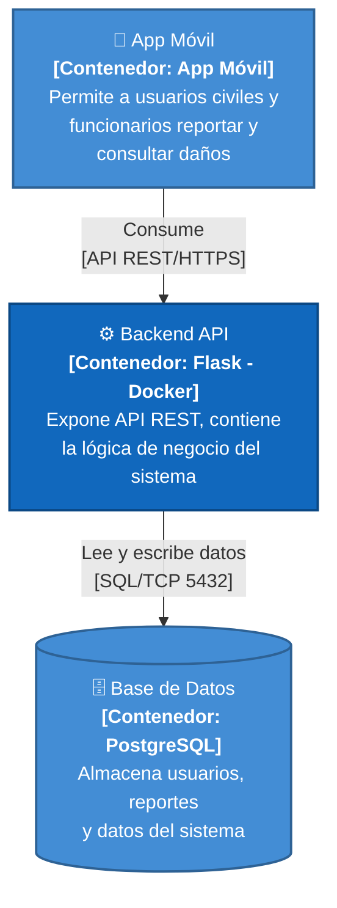

# Descrición del Modelo C4 (Nivel 2) - UrbanFix

**Autores:** Johan Felipe Aguilar Castillo · Samuel Alejandro González Grajales · Juan David Barragán

---

## NIVEL 2 — Diagrama de Contenedores

---

## Descripción de las relaciones entre contenedores

Este diagrama muestra la arquitectura actual del sistema UrbanFix a nivel de contenedores: los bloques de despliegue que realmente existen, con sus responsabilidades, tecnologías y las relaciones que mantienen entre sí.

**App Móvil → Backend API.** La aplicación móvil es el único punto de entrada para los usuarios (usuarios civiles y funcionarios) y no accede directamente a la base de datos ni a ningún otro componente interno. Toda interacción del usuario —crear un reporte, consultar el estado de una denuncia, autenticarse, dar like/dislike, comentar, etc.— se traduce en una petición HTTPS hacia el Backend API a través de una API REST. Esto mantiene a la App Móvil como una capa de presentación desacoplada de la lógica de negocio, que delega toda regla, validación y persistencia al backend.

**Backend API → Base de Datos.** El Backend API, implementado en Flask y desplegado sobre Docker, es responsable de concentrar la lógica de negocio del sistema: autenticación de usuarios, gestión de reportes, manejo de interacciones (apoyos y comentarios) y exposición de catálogos (categorías de daños y entidades públicas). Para persistir y consultar esta información, el backend se comunica con la Base de Datos PostgreSQL mediante el protocolo SQL sobre el puerto TCP 5432. Es el backend, y no la app móvil, quien tiene control exclusivo sobre las operaciones de lectura y escritura en la base de datos, lo cual centraliza la seguridad y la consistencia de los datos en un único punto.

**Propósito y audiencia de la vista.** El objetivo de este diagrama de Nivel 2 es mostrar, de forma general y accesible, cómo se distribuye la solución en contenedores desplegables y qué tecnología usa cada uno (App Móvil, Backend Flask sobre Docker y Base de Datos PostgreSQL), sin entrar en el detalle interno de componentes que sí se desarrolla en el Nivel 3. Esta vista está dirigida principalmente a arquitectos de software, desarrolladores del equipo y personas técnicas responsables del despliegue e infraestructura, ya que les permite entender rápidamente qué contenedores existen, cómo se comunican (protocolos y puertos) y dónde recae cada responsabilidad dentro del sistema UrbanFix.
