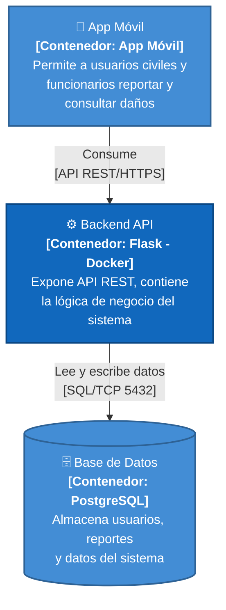
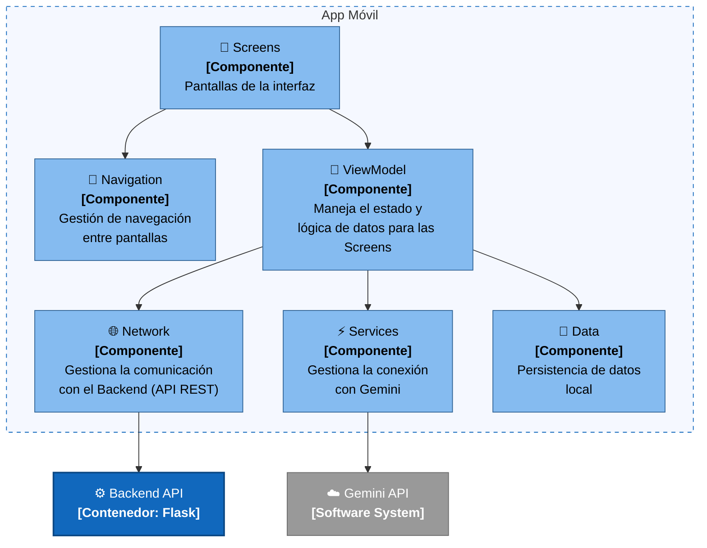

# UrbanFix — C4 Nivel 3: Diagrama de Componentes

---
## NIVEL 2 — Diagrama de Contenedores

## NIVEL 3 — Diagramas de Componentes

> Foco: contenedor **API Backend**. El diagrama de contenedores completo (Nivel 2) está en
> [06-c4-contenedores.md](./06-c4-contenedores.md).

---

### 3.2 — Componentes del Backend (Flask)

```mermaid
flowchart TB
    subgraph Backend["Backend API (Flask - Docker)"]
        direction LR

        subgraph Auth["Autenticación"]
            direction TB
            login["🔐 POST /login<br/><b>[Componente]</b><br/>Valida credenciales y<br/>retorna rol"]
        end

        subgraph Usuarios["Usuarios"]
            direction TB
            postUsuarios["👤 POST /usuarios<br/><b>[Componente]</b><br/>Registra nuevas cuentas"]
            getUsuarios["👥 GET /usuarios<br/><b>[Componente]</b><br/>Lista usuarios registrados"]
        end

        subgraph Reportes["Reportes"]
            direction TB
            postReportes["📝 POST /reportes<br/><b>[Componente]</b><br/>Crea denuncias con<br/>geolocalización e imágenes"]
            getReportes["📋 GET /reportes<br/><b>[Componente]</b><br/>Lista reportes (apoyos y estado)"]
        end

        subgraph Interacciones["Interacciones"]
            direction TB
            postApoyos["👍 POST /apoyos<br/><b>[Componente]</b><br/>Registra like/dislike"]
            postComentarios["💬 POST /comentarios<br/><b>[Componente]</b><br/>Añade notas a un reporte"]
        end

        subgraph Catalogos["Catálogos"]
            direction TB
            getCategorias["🏷️ GET /categorias<br/><b>[Componente]</b><br/>Tipos de daños"]
            getEntidades["🏛️ GET /entidades_publicas<br/><b>[Componente]</b><br/>Entidades responsables"]
        end
    end

    baseDatos[("🗄️ Base de Datos<br/><b>[Contenedor: PostgreSQL]</b>")]

    Auth --> baseDatos
    Usuarios --> baseDatos
    Reportes --> baseDatos
    Interacciones --> baseDatos
    Catalogos --> baseDatos

    style login fill:#85bbf0,color:#000,stroke:#2e6295
    style postUsuarios fill:#85bbf0,color:#000,stroke:#2e6295
    style getUsuarios fill:#85bbf0,color:#000,stroke:#2e6295
    style postReportes fill:#85bbf0,color:#000,stroke:#2e6295
    style getReportes fill:#85bbf0,color:#000,stroke:#2e6295
    style postApoyos fill:#85bbf0,color:#000,stroke:#2e6295
    style postComentarios fill:#85bbf0,color:#000,stroke:#2e6295
    style getCategorias fill:#85bbf0,color:#000,stroke:#2e6295
    style getEntidades fill:#85bbf0,color:#000,stroke:#2e6295
    style baseDatos fill:#438dd5,color:#fff,stroke:#2e6295,stroke-width:2px
    style Backend fill:#f5f8ff,stroke:#1168bd,stroke-width:1px,stroke-dasharray: 5 5
    style Auth fill:none,stroke:#8ab4e8,stroke-dasharray: 3 3
    style Usuarios fill:none,stroke:#8ab4e8,stroke-dasharray: 3 3
    style Reportes fill:none,stroke:#8ab4e8,stroke-dasharray: 3 3
    style Interacciones fill:none,stroke:#8ab4e8,stroke-dasharray: 3 3
    style Catalogos fill:none,stroke:#8ab4e8,stroke-dasharray: 3 3
```

## 3. Componentes y sus relaciones

| Componente | Responsabilidad | Relación principal |
|---|---|---|
| Módulo de Usuarios y Autenticación | Registro de cuentas, login (con distinción de rol `usuario`/`funcionario`), actualización y borrado de cuenta | Consulta y modifica `Usuario`/`Funcionario` vía la Capa de Modelos ORM; sube foto de perfil vía Utilidades de Almacenamiento |
| Módulo de Reportes | Alta, consulta, actualización, borrado de reportes; cambio de estado (`Nuevo → En proceso → Resuelto`); exportación GeoJSON | Persiste `Reporte`/`Categoria` vía Modelos ORM; sube imágenes de reporte vía Utilidades de Almacenamiento |
| Módulo de Interacciones | Reacciones (like/dislike) y comentarios sobre reportes | Persiste `Apoyo`/`Comentario` vía Modelos ORM |
| Módulo de Funcionarios y Entidades | Alta y consulta de funcionarios y entidades públicas responsables | Persiste `Funcionario`/`EntidadPublica` vía Modelos ORM |
| Capa de Modelos ORM | Define el esquema de datos del dominio y las operaciones de persistencia | Se apoya en el objeto `db` (SQLAlchemy) conectado a PostgreSQL |
| Utilidades de Almacenamiento (S3) | Decodifica base64, normaliza la imagen con Pillow y la sube a AWS S3 | Usa el cliente `s3_client` (boto3) inicializado en `app/__init__.py` |

---

## 4. Tabla de trazado C4 (Nivel 2 y Nivel 3)

Traza cada elemento representado en los diagramas C4 (el de contenedores en
[06-c4-contenedores.md](./06-c4-contenedores.md) y el de componentes de la sección 2 de este
documento) contra su ancla real en el código. Se incluyen tanto elementos de **Nivel 2** como de
**Nivel 3** porque la trazabilidad debe auditar el modelo completo, no solo el nivel más profundo.

| ID | Nivel C4 | Elemento C4 | Responsabilidad | Archivo / módulo real | Clase, símbolo o configuración verificable | Relación verificada | Estado | Observación / corrección |
|---|---|---|---|---|---|---|---|---|
| C4-2-01 | C4-2 | Cliente Android | Captura de imagen, geolocalización, UI de reporte y seguimiento | No aplica — repositorio distinto | No aplica | Cliente Android → API Backend (login, reportes, comentarios, reacciones) | `Fuera de alcance` | El código Android no está en este repositorio; la relación se documenta por declaración de los documentos 01/02, no por inspección de código. No se cuenta como "Verificado" para no sobrerrepresentar la evidencia. |
| C4-2-02 | C4-2 | API Backend | Ejecutar la API REST de UrbanFix, contenerizada con Docker | `app/__init__.py`, `app.py`, `Dockerfile` | `create_app()` en `app/__init__.py:18-29`; `CMD ["python3", "app.py"]` en `Dockerfile` | API Backend → PostgreSQL (`db.init_app(app)`); API Backend → AWS S3 (`s3_client` boto3) | `Verificado` | Ninguna corrección. |
| C4-2-03 | C4-2 | Base de datos PostgreSQL | Persistir usuarios, reportes, comentarios, apoyos y catálogos | `config.py`, `docker-compose.yml` | `Config.SQLALCHEMY_DATABASE_URI` en `config.py:7-19`; servicio `db` (`postgres:16-alpine`) en `docker-compose.yml:2-11` | PostgreSQL ← Capa de Modelos ORM (toda clase con `__tablename__` en `models.py`) | `Corregido` | Se corrigió representar "una sola base de datos": `config.py` resuelve la URI de dos formas distintas — `DATABASE_URL` (contenedor Docker local) o `PGHOST`/`PGUSER`/`PGDATABASE` (Neon). Ambas anclas son reales; omitir una habría sido evidencia incompleta. |
| C4-3-01 | C4-3 | Módulo de Usuarios y Autenticación | Registro, login y gestión de cuenta | `app/routes.py` | `handle_usuarios()` líneas 16-38; `login()` líneas 41-74; `update_usuario()`/`delete_usuario()` líneas 621-663 | Usa Capa de Modelos ORM (`Usuario.query`, `Funcionario.query`); usa Utilidades de Almacenamiento (`update_usuario_foto()` líneas 370-397 llama a `upload_profile_pic_to_s3`) | `Verificado` | Ninguna corrección. |
| C4-3-02 | C4-3 | Módulo de Reportes | Crear, consultar, actualizar y eliminar reportes; exportar GeoJSON | `app/routes.py` | `handle_reportes()` líneas 83-165; `reportes()` líneas 479-518; `update_reporte_estado()` líneas 721-753; `get_reportes_geojson()` líneas 816-859; `update_reporte()` líneas 868-914 | Usa Capa de Modelos ORM (`Reporte.query`, `Categoria.query`); usa Utilidades de Almacenamiento (`upload_base64_to_s3`, importada en `routes.py:4`) | `Verificado` | Ninguna corrección. |
| C4-3-03 | C4-3 | Módulo de Interacciones | Reacciones (like/dislike) y comentarios sobre reportes | `app/routes.py` | `set_reaccion()` líneas 168-246; `remove_reaccion()` líneas 248-280; `get_comentarios()`/`post_comentario()` líneas 674-720 | Usa Capa de Modelos ORM (`Apoyo.query`, `Comentario`) | `Verificado` | Ninguna corrección. |
| C4-3-04 | C4-3 | Módulo de Funcionarios y Entidades | Alta y consulta de funcionarios y entidades públicas | `app/routes.py` | `handle_entidades()` líneas 565-583; `crear_funcionario()`/`get_funcionarios()` líneas 587-618; `update_funcionario()`/`delete_funcionario()` líneas 639-671 | Usa Capa de Modelos ORM (`Funcionario`, `EntidadPublica`) | `Verificado` | Ninguna corrección. |
| C4-3-05 | C4-3 | Capa de Modelos ORM | Definir el esquema de datos del dominio | `app/models.py` | Clases `Usuario` (6-35), `Reporte` (37-117), `Comentario` (120-151), `Funcionario` (154-192), `EstadoReporte` (194-204), `EntidadPublica` (206-216), `Zona` (218-232), `Apoyo` (234-259), `Categoria` (261-273) | Persiste en PostgreSQL vía el objeto `db` (`from . import db`, `app/models.py:1`) | `Verificado` | Ninguna corrección. |
| C4-3-06 | C4-3 | Utilidades de Almacenamiento (S3) | Decodificar base64, normalizar imagen con Pillow y subirla a S3 | `app/utils.py` | `upload_base64_to_s3()` líneas 12-42; `upload_profile_pic_to_s3()` líneas 44-74 | Sube objetos a AWS S3 vía `s3_client` (boto3), inicializado en `app/__init__.py:11-16` | `Verificado` | Ninguna corrección. |
| C4-3-07 | C4-3 | Capa de Servicios (`ReporteService`, `AuthService`, etc.) | Hipotéticamente: encapsular la lógica de negocio separada de las rutas | No existe en el código | No existe — búsqueda sobre `app/` no encontró ninguna clase `*Service` | No aplica | `Eliminado` | Componente propuesto inicialmente por analogía con arquitecturas en capas (Spring/Java). Se descartó del diagrama tras validar contra el código: toda la lógica vive en los manejadores de ruta de `routes.py`. Se deja este registro para dejar constancia explícita de la eliminación. |

**Resumen de estados:** 7 elementos `Verificado`, 1 `Corregido`, 1 `Eliminado`, 1 `Fuera de alcance`
(declarado aparte para no inflar el conteo de "Verificado" con algo que no se pudo inspeccionar en
este repositorio).

---

## 5. Registro de correcciones y eliminaciones

Esta sección reúne, en un solo lugar, todo lo que cambió respecto al modelo inicial después de
validar contra el código — exigido explícitamente por la rúbrica, además de quedar reflejado en la
columna "Observación / corrección" de la tabla anterior.

| # | Supuesto inicial | Corrección/eliminación aplicada | Evidencia que la motivó | ID de la tabla |
|---|---|---|---|---|
| 1 | Se consideró modelar una capa de servicios (`ReporteService`, `AuthService`) por analogía con proyectos en capas típicos (p. ej. Spring) | **Eliminado** del diagrama y de la tabla de trazado | Búsqueda en `app/` sin resultados para clases `*Service`; toda la lógica está en `app/routes.py` | C4-3-07 |
| 2 | Se consideró representar "Base de datos PostgreSQL" como un único contenedor sin distinguir entornos | **Corregido**: se documentaron explícitamente las dos anclas reales (Neon vía variables `PGHOST`/`PGUSER`/`PGDATABASE`, y contenedor Docker local vía `DATABASE_URL`) | `config.py:7-19` resuelve `SQLALCHEMY_DATABASE_URI` de dos formas distintas según exista o no `DATABASE_URL`; `docker-compose.yml` define el servicio `db` local | C4-2-03 |
| 3 | Se consideró listar "Gemini AI" y "Mapbox" como componentes de Nivel 3 del backend, siguiendo el detalle del contexto del documento 05 | **Eliminado** de esta tabla (no se creó fila para ellos) | Ya verificado en [05-c4-contexto.md §4.1](./05-c4-contexto.md): esas integraciones son del cliente Android, no del backend — incluirlas aquí repetiría el error ya corregido en el documento 04 §7.2 | — (no aplica ID; se documenta como ausencia deliberada) |
| 4 | Se consideró marcar "Cliente Android" como `Verificado` igual que los demás contenedores | **Corregido** a un estado propio (`Fuera de alcance`) en vez de forzarlo a una de las tres categorías obligatorias | El código Android no existe en este repositorio backend; marcarlo `Verificado` habría sido una afirmación sin evidencia inspeccionable | C4-2-01 |
