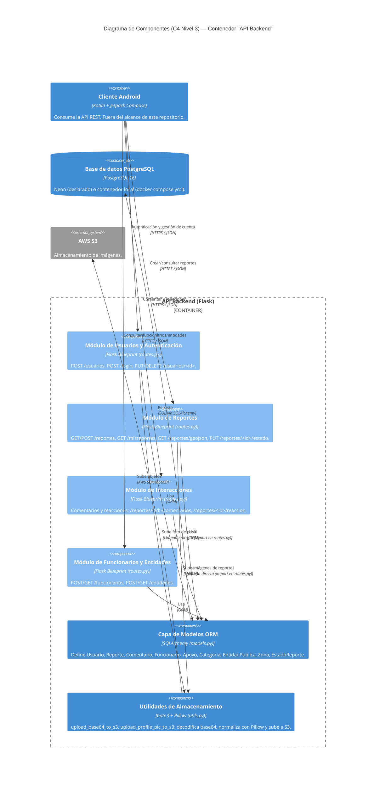

# UrbanFix — C4 Nivel 3: Diagrama de Componentes

**Proyecto:** UrbanFix — Aplicación móvil para el reporte de problemáticas urbanas
**Asignatura:** Arquitectura de Software — Universidad de Bogotá Jorge Tadeo Lozano
**Documentos previos:** [01](./01-contexto-sistema.md) · [02](./02-stakeholders-drivers.md) · [03](./03-atributos-calidad.md) · [04](./04-escenarios-calidad.md) · [05](./05-c4-contexto.md) · [06](./06-c4-contenedores.md)

---

## Índice interno

1. Propósito y audiencia de esta vista
2. Diagrama C4 Nivel 3 — Componentes
3. Componentes y sus relaciones
4. Tabla de trazado C4 (Nivel 2 y Nivel 3)
5. Registro de correcciones y eliminaciones
6. Declaración de uso de IA

---

## 1. Propósito y audiencia de esta vista

Esta vista responde: **¿de qué partes internas está hecho el contenedor "API Backend" y cómo se
relacionan entre sí y con lo externo?** Es la vista de mayor detalle de la serie C4 de este
proyecto — por debajo de Nivel 3 ya se está en el código fuente, no en un diagrama.

**Audiencia:** el equipo de desarrollo que va a modificar el backend, y el evaluador que necesita
comprobar que el modelo arquitectónico corresponde al código real y no a una intención de diseño no
implementada.

**Alcance declarado:** se documentan únicamente los componentes del contenedor **API Backend**
(Flask), por ser el único contenedor de este repositorio con código fuente propio. El contenedor
"Cliente Android" no se descompone en componentes porque su código no está en este repositorio —
se referencia solo para mostrar dónde termina la responsabilidad del backend.

**Contenido mínimo cubierto en este documento**, según lo exigido:

- Diagrama C4 Nivel 3 con los componentes arquitectónicamente relevantes.
- Responsabilidades y relaciones de cada componente.
- Tabla completa de trazado C4.
- Registro de correcciones/eliminaciones después de validar contra el código.

**No se presenta un inventario de todas las clases del sistema.** La tabla de la sección 4 cubre
únicamente los contenedores y componentes que el equipo decidió representar como
arquitectónicamente relevantes en los diagramas C4 (secciones 2 y en
[06-c4-contenedores.md](./06-c4-contenedores.md)).

---

## 2. Diagrama C4 Nivel 3 — Componentes

> Foco: contenedor **API Backend**. El diagrama de contenedores completo (Nivel 2) está en
> [06-c4-contenedores.md](./06-c4-contenedores.md).

**Nota de honestidad arquitectónica.** El backend real **no** tiene una capa de servicios separada
de las rutas (no existen clases `ReporteService`, `AuthService` ni equivalentes). Toda la lógica de
negocio vive directamente en los manejadores de ruta de un único Blueprint (`app/routes.py`). Los
cuatro "módulos" del diagrama (Auth, Reportes, Interacciones, Funcionarios/Entidades) son
**agrupaciones lógicas de rutas por responsabilidad**, no clases reales — a diferencia de la Capa de
Modelos ORM y las Utilidades de Almacenamiento, que sí son módulos de código separados
(`models.py`, `utils.py`). Esta distinción se declara explícitamente en la tabla de la sección 4,
y el intento inicial de modelar una capa de servicios se registra como **eliminado** en la sección 5.

---

## 3. Componentes y sus relaciones

| Componente | Responsabilidad | Relación principal |
|---|---|---|
| Módulo de Usuarios y Autenticación | Registro de cuentas, login (con distinción de rol `usuario`/`funcionario`), actualización y borrado de cuenta | Consulta y modifica `Usuario`/`Funcionario` vía la Capa de Modelos ORM; sube foto de perfil vía Utilidades de Almacenamiento |
| Módulo de Reportes | Alta, consulta, actualización, borrado de reportes; cambio de estado (`Nuevo → En proceso → Resuelto`); exportación GeoJSON | Persiste `Reporte`/`Categoria` vía Modelos ORM; sube imágenes de reporte vía Utilidades de Almacenamiento |
| Módulo de Interacciones | Reacciones (like/dislike) y comentarios sobre reportes | Persiste `Apoyo`/`Comentario` vía Modelos ORM |
| Módulo de Funcionarios y Entidades | Alta y consulta de funcionarios y entidades públicas responsables | Persiste `Funcionario`/`EntidadPublica` vía Modelos ORM |
| Capa de Modelos ORM | Define el esquema de datos del dominio y las operaciones de persistencia | Se apoya en el objeto `db` (SQLAlchemy) conectado a PostgreSQL |
| Utilidades de Almacenamiento (S3) | Decodifica base64, normaliza la imagen con Pillow y la sube a AWS S3 | Usa el cliente `s3_client` (boto3) inicializado en `app/__init__.py` |

---

## 4. Tabla de trazado C4 (Nivel 2 y Nivel 3)

Traza cada elemento representado en los diagramas C4 (el de contenedores en
[06-c4-contenedores.md](./06-c4-contenedores.md) y el de componentes de la sección 2 de este
documento) contra su ancla real en el código. Se incluyen tanto elementos de **Nivel 2** como de
**Nivel 3** porque la trazabilidad debe auditar el modelo completo, no solo el nivel más profundo.

| ID | Nivel C4 | Elemento C4 | Responsabilidad | Archivo / módulo real | Clase, símbolo o configuración verificable | Relación verificada | Estado | Observación / corrección |
|---|---|---|---|---|---|---|---|---|
| C4-2-01 | C4-2 | Cliente Android | Captura de imagen, geolocalización, UI de reporte y seguimiento | No aplica — repositorio distinto | No aplica | Cliente Android → API Backend (login, reportes, comentarios, reacciones) | `Fuera de alcance` | El código Android no está en este repositorio; la relación se documenta por declaración de los documentos 01/02, no por inspección de código. No se cuenta como "Verificado" para no sobrerrepresentar la evidencia. |
| C4-2-02 | C4-2 | API Backend | Ejecutar la API REST de UrbanFix, contenerizada con Docker | `app/__init__.py`, `app.py`, `Dockerfile` | `create_app()` en `app/__init__.py:18-29`; `CMD ["python3", "app.py"]` en `Dockerfile` | API Backend → PostgreSQL (`db.init_app(app)`); API Backend → AWS S3 (`s3_client` boto3) | `Verificado` | Ninguna corrección. |
| C4-2-03 | C4-2 | Base de datos PostgreSQL | Persistir usuarios, reportes, comentarios, apoyos y catálogos | `config.py`, `docker-compose.yml` | `Config.SQLALCHEMY_DATABASE_URI` en `config.py:7-19`; servicio `db` (`postgres:16-alpine`) en `docker-compose.yml:2-11` | PostgreSQL ← Capa de Modelos ORM (toda clase con `__tablename__` en `models.py`) | `Corregido` | Se corrigió representar "una sola base de datos": `config.py` resuelve la URI de dos formas distintas — `DATABASE_URL` (contenedor Docker local) o `PGHOST`/`PGUSER`/`PGDATABASE` (Neon). Ambas anclas son reales; omitir una habría sido evidencia incompleta. |
| C4-3-01 | C4-3 | Módulo de Usuarios y Autenticación | Registro, login y gestión de cuenta | `app/routes.py` | `handle_usuarios()` líneas 16-38; `login()` líneas 41-74; `update_usuario()`/`delete_usuario()` líneas 621-663 | Usa Capa de Modelos ORM (`Usuario.query`, `Funcionario.query`); usa Utilidades de Almacenamiento (`update_usuario_foto()` líneas 370-397 llama a `upload_profile_pic_to_s3`) | `Verificado` | Ninguna corrección. |
| C4-3-02 | C4-3 | Módulo de Reportes | Crear, consultar, actualizar y eliminar reportes; exportar GeoJSON | `app/routes.py` | `handle_reportes()` líneas 83-165; `reportes()` líneas 479-518; `update_reporte_estado()` líneas 721-753; `get_reportes_geojson()` líneas 816-859; `update_reporte()` líneas 868-914 | Usa Capa de Modelos ORM (`Reporte.query`, `Categoria.query`); usa Utilidades de Almacenamiento (`upload_base64_to_s3`, importada en `routes.py:4`) | `Verificado` | Ninguna corrección. |
| C4-3-03 | C4-3 | Módulo de Interacciones | Reacciones (like/dislike) y comentarios sobre reportes | `app/routes.py` | `set_reaccion()` líneas 168-246; `remove_reaccion()` líneas 248-280; `get_comentarios()`/`post_comentario()` líneas 674-720 | Usa Capa de Modelos ORM (`Apoyo.query`, `Comentario`) | `Verificado` | Ninguna corrección. |
| C4-3-04 | C4-3 | Módulo de Funcionarios y Entidades | Alta y consulta de funcionarios y entidades públicas | `app/routes.py` | `handle_entidades()` líneas 565-583; `crear_funcionario()`/`get_funcionarios()` líneas 587-618; `update_funcionario()`/`delete_funcionario()` líneas 639-671 | Usa Capa de Modelos ORM (`Funcionario`, `EntidadPublica`) | `Verificado` | Ninguna corrección. |
| C4-3-05 | C4-3 | Capa de Modelos ORM | Definir el esquema de datos del dominio | `app/models.py` | Clases `Usuario` (6-35), `Reporte` (37-117), `Comentario` (120-151), `Funcionario` (154-192), `EstadoReporte` (194-204), `EntidadPublica` (206-216), `Zona` (218-232), `Apoyo` (234-259), `Categoria` (261-273) | Persiste en PostgreSQL vía el objeto `db` (`from . import db`, `app/models.py:1`) | `Verificado` | Ninguna corrección. |
| C4-3-06 | C4-3 | Utilidades de Almacenamiento (S3) | Decodificar base64, normalizar imagen con Pillow y subirla a S3 | `app/utils.py` | `upload_base64_to_s3()` líneas 12-42; `upload_profile_pic_to_s3()` líneas 44-74 | Sube objetos a AWS S3 vía `s3_client` (boto3), inicializado en `app/__init__.py:11-16` | `Verificado` | Ninguna corrección. |
| C4-3-07 | C4-3 | Capa de Servicios (`ReporteService`, `AuthService`, etc.) | Hipotéticamente: encapsular la lógica de negocio separada de las rutas | No existe en el código | No existe — búsqueda sobre `app/` no encontró ninguna clase `*Service` | No aplica | `Eliminado` | Componente propuesto inicialmente por analogía con arquitecturas en capas (Spring/Java). Se descartó del diagrama tras validar contra el código: toda la lógica vive en los manejadores de ruta de `routes.py`. Se deja este registro para dejar constancia explícita de la eliminación. |

**Resumen de estados:** 7 elementos `Verificado`, 1 `Corregido`, 1 `Eliminado`, 1 `Fuera de alcance`
(declarado aparte para no inflar el conteo de "Verificado" con algo que no se pudo inspeccionar en
este repositorio).

---

## 5. Registro de correcciones y eliminaciones

Esta sección reúne, en un solo lugar, todo lo que cambió respecto al modelo inicial después de
validar contra el código — exigido explícitamente por la rúbrica, además de quedar reflejado en la
columna "Observación / corrección" de la tabla anterior.

| # | Supuesto inicial | Corrección/eliminación aplicada | Evidencia que la motivó | ID de la tabla |
|---|---|---|---|---|
| 1 | Se consideró modelar una capa de servicios (`ReporteService`, `AuthService`) por analogía con proyectos en capas típicos (p. ej. Spring) | **Eliminado** del diagrama y de la tabla de trazado | Búsqueda en `app/` sin resultados para clases `*Service`; toda la lógica está en `app/routes.py` | C4-3-07 |
| 2 | Se consideró representar "Base de datos PostgreSQL" como un único contenedor sin distinguir entornos | **Corregido**: se documentaron explícitamente las dos anclas reales (Neon vía variables `PGHOST`/`PGUSER`/`PGDATABASE`, y contenedor Docker local vía `DATABASE_URL`) | `config.py:7-19` resuelve `SQLALCHEMY_DATABASE_URI` de dos formas distintas según exista o no `DATABASE_URL`; `docker-compose.yml` define el servicio `db` local | C4-2-03 |
| 3 | Se consideró listar "Gemini AI" y "Mapbox" como componentes de Nivel 3 del backend, siguiendo el detalle del contexto del documento 05 | **Eliminado** de esta tabla (no se creó fila para ellos) | Ya verificado en [05-c4-contexto.md §4.1](./05-c4-contexto.md): esas integraciones son del cliente Android, no del backend — incluirlas aquí repetiría el error ya corregido en el documento 04 §7.2 | — (no aplica ID; se documenta como ausencia deliberada) |
| 4 | Se consideró marcar "Cliente Android" como `Verificado` igual que los demás contenedores | **Corregido** a un estado propio (`Fuera de alcance`) en vez de forzarlo a una de las tres categorías obligatorias | El código Android no existe en este repositorio backend; marcarlo `Verificado` habría sido una afirmación sin evidencia inspeccionable | C4-2-01 |

---

## 6. Declaración de uso de IA

| Pregunta | Respuesta |
|---|---|
| ¿Qué herramienta se usó? | Claude (Anthropic), en sesión de apoyo del 4 de septiembre de 2026. |
| ¿Para qué se usó? | Construir el diagrama C4 Nivel 3 en Mermaid y la tabla completa de trazado C4 (Nivel 2 y Nivel 3), a partir de inspección directa del código del backend (`app/routes.py`, `app/models.py`, `app/utils.py`, `app/__init__.py`, `config.py`, `docker-compose.yml`, `Dockerfile`) y de los documentos 04 y 05 ya existentes en el repositorio. |
| ¿Qué se verificó? | Cada fila de la tabla de trazado se contrastó contra una línea o rango de líneas real del código antes de marcarla `Verificado`. Los tres elementos que no calificaban para ese estado (capa de servicios inexistente, dualidad de base de datos, cliente fuera del repositorio) se clasificaron explícitamente como `Eliminado`, `Corregido` o `Fuera de alcance`, según correspondiera, en vez de forzarlos a `Verificado`. |
| ¿Qué se rechazó? | La tentación de completar el diagrama con una capa de servicios "esperable" en una API REST bien diseñada, cuando el código real no la tiene. Incluirla habría hecho el diagrama más prolijo pero falso. |
| ¿Qué riesgo permanece? | La tabla cubre los componentes que el equipo decidió representar como arquitectónicamente relevantes, no un inventario exhaustivo de todas las funciones de `routes.py` (hay rutas menores, como `/categorias` o `/estados-reporte`, agrupadas implícitamente dentro de los módulos de Reportes y no desglosadas en filas propias). Si la rúbrica exige desglose función por función, esta tabla necesitaría filas adicionales. |
